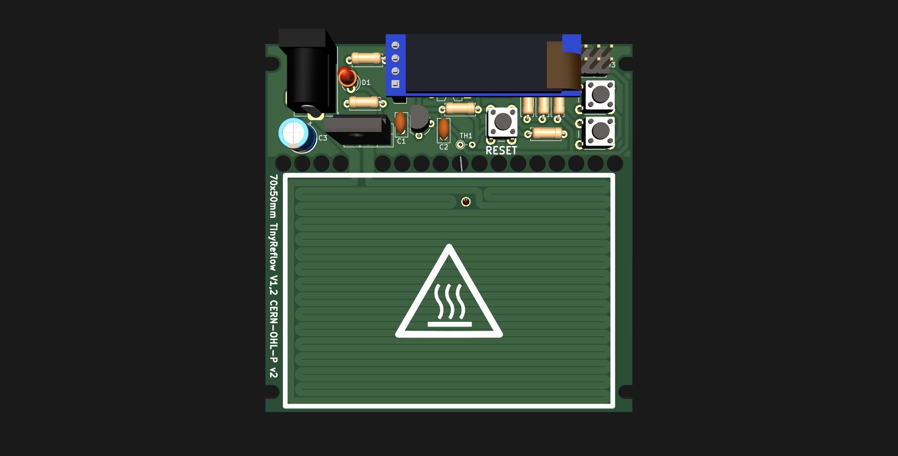

# Tinyreflow
Inspired by afterearthLTD's reflow plate, but using fewer and simpler, THT components.

Everything is functional but the code only has a curve set up for low-temp solder so far.

Licensed under CERN-OHL-P
