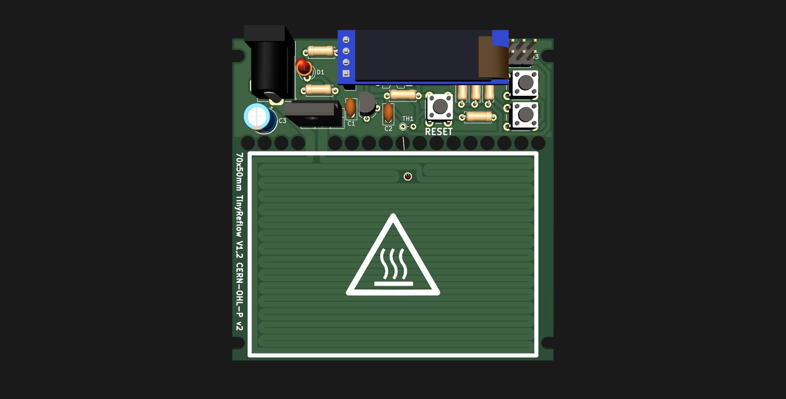

# Tinyreflow
Inspired by afterearthLTD's reflow plate, but using fewer and simpler, THT components.

Everything except the arduino code is done, but the prototypes haven't arrived yet.

Licensed under CERN-OHL-P v2
